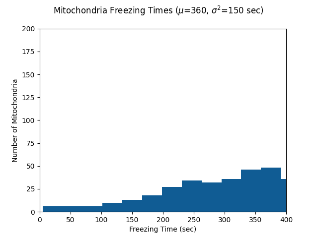

# Mitochondrial Motility Model
This model was created to provide additional validation for experimental work by Catia Silva and Christian Lohmann.
We explored the effects of simulated synaptic activity on a pool of mitochondria with normally distributed stopping times.
We also explored variations in the mean stopping time for the pool of 

Experiments as in the paper can be generated by running `main.py` directly. By default this saves plots in the folder `data/`

## Spike Train Generation
To generate simulated synaptic activity, we used the homogeneous Poisson process function from the [Elephant](https://elephant.readthedocs.io/en/latest/) package. 

The function `get_spike_trains` generates a list of times at which a simulated synaptic activity occurs. 
This function takes arguments `num_runs` and `event_hz` which specify how many simulated spike trains to generate, and the frequency of spikes respectively.

If `event_hz` is a list of multiple frequencies, the function will generate spike trains with each frequency generated for a fixed block of time (specified by the parameter `freq_block`). 

To visualize the spike trains generated, use the function `plot_spike_trains` specified in `plotting.py`. 

An example raster plot with multiple spike frequencies (each block = 1500s): 

## Simulating a Pool of Mitochondria 
We modeled the effect of synaptic inputs of varying frequency on pools of mitochondria with different mean stopping and 
recovery times. For all experiments we generate a population of 500 instances of a `mitochondrion` object class defined in `util.py`

### Stopping Times
We established experimentally a lower bound for the mean duration of immobilization of approximately 70 s.
We generated a population of mitochondria with mean arrest durations drawn from a Gaussian distribution
We repeated this process varying the parameters of the Gaussian distribution (µ = 1–5 min, σ = 2.5 min). 
We found that the distributions for 1–3 min were comparable with our observed duration distributions from experimental results.

Population stopping time histograms are generated by the function `mito_stop_hist` in `plotting.py`. 

An example histogram of mitochondrial stopping times: 

### Recovery Times

## Effects of Mean Arrest Time and Synaptic Input on Mitochondrial Motility 

-- Dose response 