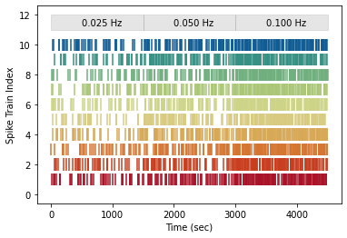

# Mitochondrial Motility Model
This model was created to provide additional validation for experimental work by Catia Silva and Christian Lohmann at 
the [Netherland Institute for Neuroscience](https://nin.nl/research/researchgroups/lohmann-groep/).
We explored the effects of simulated synaptic activity on a pool of mitochondria with normally distributed stopping times.
We also generated dose response curves varying synatpic event frequencies on pools of mitochondria with varying mean stopping times.

Experiments as in the paper can be generated by running `main.py` directly. By default this does not save plots of simulation results,
but changing the plotting arguments passed to the main function will generate saved plots in the folder `data/`. 

The notebook `walkthrough.ipynb` shows the generation of relevant data and figures in a stepwise fashion.

## Spike Train Generation
To generate simulated synaptic activity, we used the homogeneous Poisson process function from the [Elephant](https://elephant.readthedocs.io/en/latest/) package. 

The function `get_spike_trains` generates a list of times at which a simulated synaptic activity occurs. 
This function takes arguments `num_runs` and `event_hz` which specify how many simulated spike trains to generate, and the frequency of spikes respectively.

If `event_hz` is a list of multiple frequencies, the function will generate spike trains with each frequency generated for a fixed block of time (specified by the parameter `freq_block`). 

To visualize the spike trains generated, use the function `plot_spike_trains` specified in `plotting.py`. 

An example raster plot with multiple spike frequencies (by default each block = 1500s): 

## Simulating a Pool of Mitochondria 
We modeled the effect of synaptic inputs of varying frequency on pools of mitochondria with different mean stopping times. 
For all experiments we generate a population of 500 instances of a `mitochondrion` object class defined in `util.py`

### Stopping Times
We established experimentally a lower bound for the mean duration of immobilization of approximately 70 s.
We generated a population of mitochondria with mean arrest durations drawn from a Gaussian distribution
We repeated this process varying the parameters of the Gaussian distribution (µ = 1–5 min, σ = 2.5 min). 
We found that the distributions for 1–3 min were comparable with our observed duration distributions from experimental results.

Mito stopping times are an attribute of each instantiation of the `mitochondrion` class defined in `util.py`. 
For a given population of mitochondria, each member has its own stopping time.

In the function `F.populate_list_n` the parameter `noisy_recovery` is by default True, 
which means mito stopping times are drawn from a normal distribution with  $\mu$= `recov_mean` and  $\sigma$=  `recov_sd`. 
If `noisy_recovery` is False, all mitos have a stopping time of `recov_mean`.

Population stopping time histograms are generated by the function `mito_stop_hist` in `plotting.py`. 

An example histogram of mitochondrial stopping times: 

### Recovery Times
For each synaptic event, a subset of the mobile mitochondria are selected for immobilization. Each mitochondrion remains 
immobile for the duration of its stopping time. After this time has elapsed, the mitochondrion returns to the mobile fraction.

An example plot of the fraction of mitochondria in the mobile pool with a constant rate of synaptic input: 
